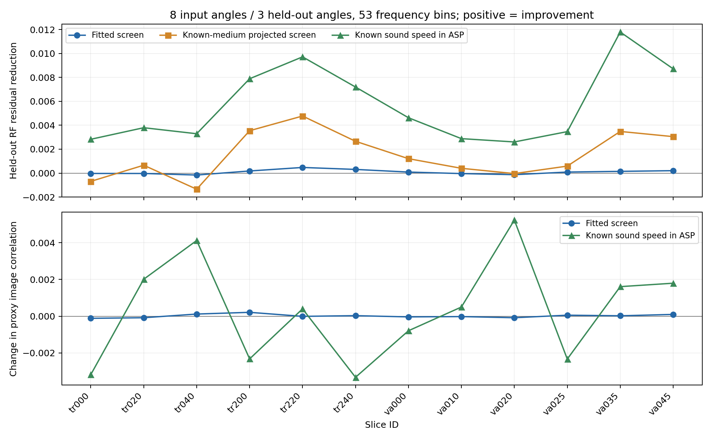

# 11角度UltraWave数据：无网络有效相位屏拟合试验

日期：2026-09-16  
项目：`/home/zhuangyang/fmmodel/neural_asp`  
实现：`scripts/pilot_phase_asp.py`  
状态：GPU试验已完成；以下结果只支持当前配置和抽样范围内的判断。

## 结论

**直接从8个输入角度拟合12层×48控制点的有效相位屏，在当前试验中没有得到可信的畸变校正收益。** 12个切片上，留出3角度的平均RF相对残差从0.649723降到0.649633，差0.000090；其中7例下降、5例上升。输入角度残差从0.582274降到0.581860，但代理散射结构的成像相关性只从0.321691变为0.321708。这个量级和一致性不足以支持“相位屏已经有效改善成像”的说法。

已知介质投影出的相位屏有一定潜力，平均留出残差为0.648200；直接把现有声速真值送入异质角谱算子的参考结果为0.643988，12例留出残差都低于均匀基线。后一方法在UltraWave全波数据上仍是**近似物理参考**，不是严格的可达上界。当前主要问题是低维屏表示损失，以及从RF拟合时与未知散射图、前向失配的耦合；现有结果不能把两者精确分摊。

## 试验设置

数据来自已生成的500例11角度UltraWave集。本次取12个切片，覆盖两个训练来源病例，每例都独立拟合自己的相位屏；没有训练神经网络。

| 病例 | 用于试验的训练切片 | 用于试验的验证切片 |
|---|---|---|
| Neg_07_Left | train_000、train_020、train_040 | val_000、val_010、val_020 |
| Neg_35_Left | train_200、train_220、train_240 | val_025、val_035、val_045 |

50个正式测试切片没有参与本次试验。相邻切片来自同一病例，不构成12个独立患者；本报告只报告逐例和两个病例的观察，不给出患者级泛化置信区间。

当前配置的严格留出协议：输入角索引 `[0,1,3,4,6,7,9,10]`，留出角索引 `[2,5,8]`。相位屏及散射图拟合只读输入RF；留出RF只用于最终评价。结果对应“8角度估计、3角度预测”，**不是全部11角度同时输入的主成像试验**。

相位屏与均匀基线共享同一个角谱/Born算子。脚本从每个shard读取实际逐角度发射时间，设置中心化阵列和真值网格像素中心 `x0=-19.125 mm、z0=0.075 mm`；横向各加32个0.2 mm网格点保护带，计算宽度256点。保护带外的散射图和声速扰动设零，这只是本pilot的计算近似，可能遗漏裁剪视野外的散射。

主要12例结果使用配置请求的64频点，但现有 `select_evenly` 实际得到**53个频点**，频带为4–7.5 MHz内的稀疏频点。系统频响设为固定的单位复响应，没有逐样本或留出数据拟合增益。另做2例完整210连续频点检查。

散射图 `m` 对每个传播参数使用**同一个**带L2正则的8步CG求解器，由8输入角度重建。正则尺度由均匀算子估计，比例 `1e-3`。对相位屏先在均匀基线估计的固定m上优化，然后用最终屏重新估计m，比较两种方法的输入残差、留出残差及成像结构代理相关性。这个固定m优化目标与重新估计m后的最终目标不同，因此即使输入残差降低也不能保证留出或图像改善。

屏有12个深度控制层、每层48个横向控制点，逐层去除物理视野的横向均值，控制层时延约束在±0.2 μs；另拟合2个深度公共累计时延系数，各约束在±2 μs。30步Adam，学习率0.001，正则权重0.01；按**输入角度、固定m的目标**选最优迭代，不用留出角度选步。脚本没有修改旧声速模型与训练代码。

“已知介质投影屏”从保存的200 μm块平均声速 `c` 转换为传播时延，再投影到相同控制基，并用相同CG重建m；它使用真值，仅作为表示能力诊断。它不是可从RF直接获得的方法。“已知c角谱”将shard中的 `delta_s` 直接送入原角谱算子，同样只做诊断。

## 主要结果

各列为逐切片指标的算术平均；RF数值越低越好。`图像相关` 是角谱伴随图**幅值**与保存的代理 `|m|` 的Pearson相关，不等于真实临床图像质量。

| 方法 | 12例输入RF残差 | 12例留出RF残差 | 留出改善例数/12 | 12例图像相关 |
|---|---:|---:|---:|---:|
| 均匀角谱，正确采集基准 | 0.582274 | 0.649723 | — | 0.321691 |
| **直接拟合12×48屏+2公共量** | **0.581860** | **0.649633** | 7 | 0.321708 |
| 已知介质投影到同样的屏 | — | 0.648200 | 9 | — |
| 已知c的异质角谱 | — | **0.643988** | 12 | 0.322002 |

已知介质投影屏与已知c角谱的输入/成像逐例数值保存在结果JSON中；表中省略它们的平均输入值，避免与可实际估计的方法混读。

| 病例（各6例） | 均匀留出 | 直接拟合留出 | 投影屏留出 | 已知c留出 | 直接拟合改善例数 |
|---|---:|---:|---:|---:|---:|
| Neg_07_Left | 0.647135 | 0.647186 | 0.647104 | 0.643797 | 1/6 |
| Neg_35_Left | 0.652311 | 0.652079 | 0.649295 | 0.644180 | 6/6 |

两个病例的差异明显：第二病例的直接拟合屏6例留出残差都略降，第一病例6例中只有1例下降。无论哪一组，幅度都很小；逐病例的图像相关性变化也不足以支持成像收益。



## 频带与屏容量检查

**完整210频点。** 对 `train_000` 和 `val_000` 重跑20步拟合、其余相同：均匀、直接拟合、已知介质投影屏、已知c的平均留出残差依次为 `0.642274 / 0.642167 / 0.641369 / 0.638425`。直接拟合有约0.000107的微小下降，图像相关性从0.348841变为0.348831。53频点的“RF差异小、成像无明确改善”结论在这两例完整频带检查中没有被推翻；2例不能替代全频带、全验证集评估。

**控制容量。** 在第一病例的6例上，以已知c投影构造24层×96点的更密相位屏，且保留2公共量。留出残差均值为0.646566；同6例的12×48投影屏为0.647104，均匀基线0.647135，已知c角谱0.643797。加密控制点确实改善了投影屏的RF拟合，但仍未追平完整慢度场。这只是**投影屏**的容量诊断，没有运行24×96参数的直接RF拟合；不能据此断言高容量优化能成功。

## 代码与结果

- 服务器脚本：`/home/zhuangyang/fmmodel/neural_asp/scripts/pilot_phase_asp.py`
- 本地脚本副本：`F:/levelC/Server/phase_aberration_design/pilot_phase_asp.py`
- 服务器主要结果：`runs/l11_phase_asp_pilot_v3_bulk/`（第一病例）、`runs/l11_phase_asp_pilot_case2/`（第二病例）
- 服务器容量检查：`runs/l11_phase_asp_projection_24x96/`
- 服务器完整频带检查：`runs/l11_phase_asp_fullband_check/`
- 本地对应结果：`F:/levelC/Server/phase_aberration_design/results/`，每例有JSON及保存的相位控制量/两张m图。

复现主要试验：

```bash
cd /home/zhuangyang/fmmodel/neural_asp
PY=/home/zhuangyang/miniconda3/envs/py310/bin/python
CUDA_VISIBLE_DEVICES=1 "$PY" scripts/pilot_phase_asp.py \
  --gpu 0 --samples train_000 train_020 train_040 val_000 val_010 val_020 \
  --out runs/l11_phase_asp_pilot_v3_bulk --cg-iters 8 --opt-steps 30 \
  --fit-bulk --oracle
```

第二病例将样本换为 `train_200 train_220 train_240 val_025 val_035 val_045`。完整频带用 `--n-freq 0`。参数化自检运行 `python scripts/pilot_phase_asp.py --selftest` 已通过；GPU拟合、已知c比较、53频点/210频点及容量检查均已完成。

## 当前结论的边界与下一步

目前**不能据此启动相位屏网络训练**。直接拟合若不能先在独立角度和结构指标上形成有意义的增益，网络只会把这个辨识问题搬到参数回归中。

最值得做的下一步是一次受控点靶实验：在同一个Born/角谱生成器中注入已知12层屏，固定真实点靶m，验证拟合能否回收相位和点扩散函数；随后换成已知c全波教师，量化投影误差。对于现有乳腺RF，需要检查系统频谱响应、视野外散射、二维单向/Born近似与m求解深度。若表示oracle仍受限，再试更密的屏或角度相关的波数项；应先让**无网络**方法在两个病例上取得可复现的成像收益。
