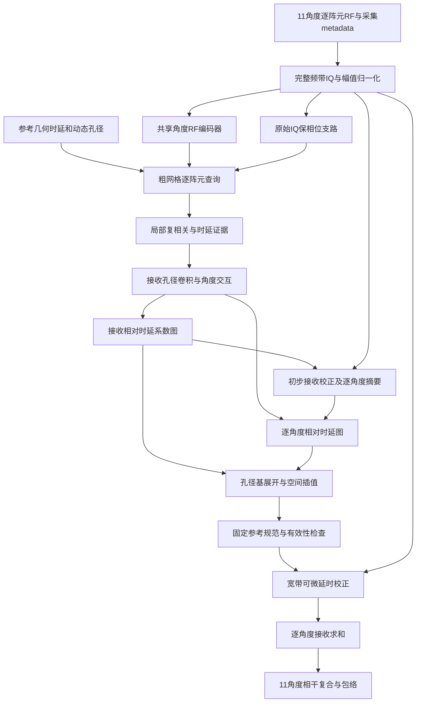

# 11角度平面波相对相位畸变预测与校正：网络设计草案

日期：2026-09-16  
代码基准：`zhuangyang@10.134.42.64:/home/zhuangyang/fmmodel/neural_asp`  
状态：已阅读代码、配置、数据生成流程及一个真实数据 shard；以下为待实验验证的设计。本次仅形成设计文档，没有修改模型或启动训练。

## 1. 建议采用的方向

第一步的目标是：**输入11个角度的逐阵元RF，直接估计用于聚焦的相对传播时延，以此生成相位校正量，在接收阵元求和前完成校正，再进行11角度相干复合。** 推理阶段不输出声速图，也不需要声速真值。

推荐网络暂名 `RelativeDelayNet`。核心输出是：

- 接收相对时延 `tau_rx[B,E,Hc,Wc]`：随成像位置和接收阵元变化，跨发射角共享。
- 角度相对时延 `tau_angle[B,A,Hc,Wc]`：描述每个发射角在该位置的有效相位/到达时间偏差。
- 相对相位由时延生成：`phi(f) = 2π f tau`。显示中心频率相位，实际校正覆盖接收频带。

这里默认将用户的“相对相位畸变量”解释为以**阵元间相对畸变**为主，同时保留角度间校正；这是设计假设，尚未获得用户进一步限定。若只研究角度间复合，可单独训练角度分支，但该实验不足以验证接收孔径的失焦是否得到修复。

选择这个方向的理由：现有任务最终需要正确聚焦，而声速反演额外要求恢复介质参数；直接学习聚焦量更接近成像目标。不过，相位/时延与散射结构之间仍可能混淆，输出维度还可能更高，因此不能预设它一定比声速预测容易。

首版采用**已知参考声速下的几何查询 + 保留阵元的特征提取 + 相对时延双分支 + 可微宽带延时求和**。现有角谱/Born管线作为对照和离线教师工具。后续是否接入新的RF前向一致性模型，由首版聚焦实验决定。

## 2. 当前代码实际做了什么

### 2.1 模型与训练路径

```text
rf [B,A,E,T]
 ├─ rf_to_D → D [B,A,F,E]
 └─ demod_iq → IQ [B,A,E,Ti]
      ↓ RFEncoder：不同角度共享卷积，时间下采样
      ↓ delay_integrate：几何查询后对接收阵元求和
      ↓ 每角度复数DAS + 角度注意力池化
      ↓ FNO → 平滑、有界的粗网格delta_s
      ↓ 插值 → 异质角谱传播 → 发射波场
      ↓ Born前向/伴随 + ComplexProx展开
      ↓ m_hat、c_hat、RF预测和图像
```

| 代码位置（相对服务器项目根目录） | 已核对的行为 | 对新设计的影响 |
|---|---|---|
| `models/encoder.py:12–40` | 三层 `(3,7)` 卷积，时间总步长8，阵元轴保留 | 可复用共享编码的思路；必须增加保相位支路 |
| `models/neural_operator.py:94–125` | 根据几何建时延表；DAS通道数量绑定非留出角度数量 | 新模型用角度坐标和mask，不能固定拼接8角度 |
| `models/neural_operator.py:148–188` | 阵元求和后做角度池化/FNO，输出一个慢度通道 | 不能只替换最后一层；相位证据应在求和前处理 |
| `physics/imaging.py:192–215` | `delay_integrate` 明确消去阵元轴 | 新增保留阵元的查询接口 |
| `common.py:218–245` | IQ解调；DAS插值后补回载频相位 | 沿用信号约定，新增校正符号测试 |
| `models/pipeline.py:137–205` | 先估慢度，再重建散射图；留出角度通过前向算子预测 | 首版相位成像器不具备同等RF预测能力 |
| `train.py:52–81,143–152` | 慢度监督、RF损失、代理m监督；非m阶段按声速RMSE选优 | 新训练目标和选模标准均需独立定义 |
| `data/l11_kwave.py:53–89` | 全部样本堆叠到device；不向模型返回采集metadata | 新数据适配器应逐样本加载并校验metadata |

项目根目录及其父目录当前不是Git仓库，无法核对提交历史。没有发现适用于本项目的 `AGENTS.md`。本设计依据读取时的工作目录文件，不对应一个可引用的Git commit。

### 2.2 11角度数据现状

数据目录：`/data/zhuangyang/NumerialBreastPhantoms/l11_ultrawave_500_11angle`。

读取到 `READY`（2026-09-15 22:04）及 `dataset_report.json` 中 `ok=true`。报告记录500例，划分为400/50/50；本次额外抽查了 `train_000.pt` 和其原始NPZ，没有重新逐例验证500例。

| 项目 | 实际值 |
|---|---|
| RF | float32 `[11,192,2401]` |
| 已存D | complex64 `[11,53,192]` |
| `c / delta_s / m` | `[216,192]`，m为complex64 |
| 发射角 | −8°至+8°，间隔1.6° |
| RF采样率 | 40 MHz，记录约60 μs |
| 接收频带 | 4–7.5 MHz |
| 发射脉冲中心频率 | 7.5 MHz |
| 当前IQ解调中心 | 5.75 MHz，抽取2倍后20 MHz、1201个IQ采样 |
| 阵元 | 192，间距0.2 mm |
| 成像/真值网格 | 216×192，间距0.2 mm |
| 仿真来源 | UltraWave二维线性声学全波，含吸收；不含BonA非线性 |
| 解剖独立性 | 500个不同切片，来自3个病例；不是500个独立患者 |

当前输入索引是 `[0,1,3,4,6,7,9,10]`，留出索引是 `[2,5,8]`，对应 −4.8°、0°、+4.8°。**当前训练没有把全部11角度送入网络，0°也被留出了。** 新方案的11角度主实验不能照搬这个默认行为。

现有shard只有 `rf/D/c/delta_s/m/metadata`；没有 `tau/phase/Green函数/同一散射体的无畸变RF` 标签。`reference_native.npz` 是用于扣除均匀参考介质响应的记录，不能直接当作每个乳腺样本的无畸变散射RF。

### 2.3 必须先处理的采集一致性问题

**发射时间缺失。** 当前11角度YAML没有 `acq.t_ref_s`，`build_meta` 因此使用全零；实际shard包含 `source_tref_s`，约为：

```text
角度（度）  -8       -6.4     -4.8     -3.2     -1.6      0
t_ref(μs)  2.259441 1.915838 1.571156 1.225665 0.879634 0.533333

正角度与对应负角度对称。
```

这部分时间属于已知发射基准，应在几何时延中显式加入，不应交给网络预测。

**坐标基准不一致。** 当前11角度配置构造的阵元坐标为 `[0.1,38.3] mm`，生成器的物理阵元坐标为 `[-19.1,19.1] mm`；同时生成器的发射参考时间基于中心化坐标，不能只平移阵元坐标而不变换发射公式。真值由50 μm网格的4×4块均值生成，结合 `crop_x_start=176`、`crop_z_start=60` 可推出真值像素中心：

```text
array.center_x = 0 m
grid.x0 = -0.019125 m
grid.z0 = 0.000075 m
grid.dx = grid.dz = 0.0002 m
```

这是由生成器 `geometry()` 和 `truth_maps()` 推导的坐标；首个实现任务应核对全部样本并写入版本化metadata。生成器pilot图像使用另一组显示网格，不能将它直接解释为与上述真值像素中心逐点一致。

**频点不是64个。** YAML请求 `n_freq=64`，`select_evenly` 按整数步长抽取后实际为53个；完整带内为210个连续FFT频点。新主成像路径从RF/IQ读取完整频带。若计算全带D，应重新从RF计算并更改缓存版本，不能给旧53频点D配上新频率轴。

**修复不能由网络代偿。** 三角度修复配置已使用显式时间/坐标及训练集频响校准，但11角度配置没有自动继承。其校准文件也不能直接移用于新的仿真后端和采集协议。先建立正确的11角度均匀介质基线，再比较相位模型。

## 3. “相对相位”需要怎样定义

令 `a` 为发射角，`e` 为接收阵元，`r=(x,z)` 为成像点。参考声速 `c0=1540 m/s` 下：

\[
t^0_{a,e}(r)=t_{\mathrm{ref},a}
+\frac{x\sin\theta_a+z\cos\theta_a}{c_0}
+\frac{\sqrt{(x-x_e)^2+z^2}}{c_0}.
\]

真实有效传播时间与参考模型之差记为 `delta_t[a,e,r]`。它相对于已知几何传播；它不等于RF本身的瞬时相位，后者还包括散射、系统响应和噪声。

### 3.1 推荐参数化：接收项 + 角度项

\[
\widehat{\delta t}_{a,e}(r)
=\hat\tau^{rx}_{e}(r)+\hat\tau^{angle}_{a}(r).
\]

在静态、单次散射和局部有效传播近似下，同一像素到阵元的接收路径不随发射角变化，因此将接收项跨角共享是合理的约束。角度项用于补偿剩余的角度间差异，**不宣称已从普通散斑RF中唯一分离出了真实发射传播路径**。多径或强角度依赖散射会使这一分解失效。

为固定参考，采用确定的非负几何权重，且在训练标签、模型输出、校正层和指标中完全一致：

\[
\sum_e w^{rx}_e(r)\hat\tau^{rx}_e(r)=0,\qquad
\sum_{a\in\mathcal A_{in}}w^{angle}_a(r)
\hat\tau^{angle}_a(r)=0.
\]

权重分别归一化为和1。接收权重来自固定动态孔径与有效采样mask；角度权重在有效输入角上均匀分配。首版不使用网络预测的置信度作为规范化权重，避免参考系随网络变化。没有有效观测的点输出零校正及无效mask。

使用零均值参考比固定一个阵元或0°更方便：坏阵元不决定整个参考，也支持0°缺失。可在显示时转换成相对中心阵元/0°的图，但训练不混用不同参考。

### 3.2 相对量有明确的边界

所有角度和阵元共同的空间相关时延 `g(r)` 被相对化去除。对于窄带相干求和，这主要留下公共相位；对于宽带采样，它还意味着公共包络时间偏移。

因此首版的声明是**恢复相对聚焦和角度间相干性**，不能直接声称恢复绝对传播时间、定量声速或完全正确的空间位置。已知采集时间不能作为这种自由度被去掉。实验必须报告定位偏差，并比较“绝对时延oracle”和“同一零均值规范的相对oracle”，量化相对表示的损失。

相对时延不是完全可辨识的：错误聚焦到另一个散射体，也可能增加相干性。后续损失和点靶评估必须约束这一退化。

### 3.3 为什么预测时延，再转换相位

中心频率 `f_c=5.75 MHz` 时：

\[
\phi_{a,e}(r;f)=2\pi f\widehat{\delta t}_{a,e}(r).
\]

一个周期仅约174 ns；40 MHz采样间隔25 ns相当于约0.903 rad。仅回归 `[-π,π)` 内相位会失去整周期信息，仅旋转中心频率IQ也不能完整校正4–7.5 MHz宽带脉冲的包络。

网络因此输出连续实值秒数，训练时用微秒尺度归一化；`cos(phi),sin(phi)`用于圆周损失和相位可视化。不要对包裹相位直接做普通L1/L2，也不要通过逐阵元累计包裹差分重建整条孔径。

这是一阶有效时延模型，假设有效相位在频带内以线性频率项为主。若参考波场显示显著的非线性频率残差，应升级为少量平滑子带相位残差；不能把频散/多径全部解释成一个时延。

## 4. 三种方案比较

| 方案 | 输出 | 优点 | 主要问题 | 定位 |
|---|---|---|---|---|
| A：全局薄相位屏 | 一条 `tau[e]`，可附11个角度标量 | 最容易实现和验证，标签可控 | 假定整个视野共享畸变，不适合一般分布式乳腺介质 | 必做基线 |
| **B：空间变化的接收项 + 角度项** | `tau_rx[e,r] + tau_angle[a,r]` | 校正在阵元求和前；角度共享约束控制自由度；支持11角度复合 | 需要局部可靠相位证据；不保证真实收发分解 | **首版主方案** |
| C：完整角度×阵元×空间×频率校正算子 | `phi[a,e,r,f]` 或复数传播核 | 表达多径、频率变化和更一般角度依赖 | 自由度和显存很大，易拟合散斑/系统误差，标签更难 | 有证据再扩展 |

另一个低成本消融是只输出 `tau_angle[a,r]`，修正各角度图像后复合。它对应用户可能的另一种“相对相位”含义，但已求和后的图像无法恢复此前阵元失相干丢失的能量。

不建议直接把角谱层中的 `delta_s*dz` 改名为相位。如果仍然使用逐层 `phi=omega*delta_s*dz`、相同光滑约束和相同传播结构，本质上只是慢度参数的重写，没有真正转为接收孔径的相对畸变估计。

## 5. 网络架构

### 5.1 数据流



### 5.2 输入与归一化

输入契约为 `rf[B,11,192,2401]` 与真实的 `angles/xe/t_ref/fs/fc/grid`。可选 `angle_mask` 和 `element_mask` 用于坏通道及研究角度缺失。

保留原始RF物理幅值用于成像。只在特征分支做每样本一个实数RMS归一化，RMS从有效输入角度/阵元计算，并停止其梯度；同时输入对数能量。不能独立旋转每个角度或阵元的复相位，也不能使用留出RF计算归一化统计。

复数IQ由现有 `demod_iq` 约定生成。实部/虚部成对进入普通实值网络，首版不强制引入复值卷积库；复相关特征承担显式相位关系。复值网络是后续可选消融。

### 5.3 双路编码与保留阵元的几何查询

**上下文路。** 每角度共享三层 `(3,7)` 卷积，通道 `[24,32,32]`，时间stride依次 `[1,2,2]`，不下采样阵元。采用GroupNorm和GELU。输出约 `[B,A,32,192,301]`。选择较小的时间总步长4，是为了保留较细的时间上下文；其值需要在验证集上与原步长8比较。

**保相位路。** 从原始complex IQ直接插值，保留 `Re/Im/能量/有效mask`。不使用下采样编码特征替代真实IQ做相位比较。

粗网格仍取 `Hc=54,Wc=48`，物理间隔0.8 mm。对每个粗网格位置按 `t0[a,e,r]` 查询时域特征，保留 `a,e` 两个维度。既查询中心，也提取中心附近IQ短窗，用于辨认整周期和到达时间偏差。

初始时延搜索上下文设为 `±2 μs`，在20 MHz IQ上为81个采样点。上下文长度与时延输出范围是分别配置的：若训练标签分位数表明需要更宽范围，应同步增加上下文并重新检查内存。局部相关先压缩为特征，不能把全部窗口和全视野同时展开。

### 5.4 相对相位证据

在同一几何聚焦位置，保相位支路的参考对齐通道记为 `Y[a,e,r,u]`，其中 `u` 是局部时间偏移。构造局部归一化复相关，例如：

\[
C_{a,e,j}(r)=\frac{\sum_{u\in\mathcal W}v_uY_{a,e}(r,u)Y^*_{a,j}(r,u)}
{\sqrt{\sum_uv_u|Y_{a,e}|^2\sum_uv_u|Y_{a,j}|^2}+\epsilon}.
\]

相关特征包含实部、虚部、模长和有效性，优先使用接收间隔 `1,2,4,8` 的局部连接；再加入与局部子孔径参考的连接，减少只靠最近邻累计导致的漂移。对子带及局部时移的相关响应进行小型编码，以提供时延而非只有包裹相位的证据。

不同接收阵元在扩散散射介质中不一定看到同一个理想波形；相关低既可能来自畸变，也可能来自散射角度、孔径、噪声或多径。相关模长仅作为可靠性证据，不能作为相位真值。局部时间窗和空间邻域过大又会混入不同畸变，因此窗口尺度应消融。

角度分支使用逐角度局部特征，以及初步接收校正后的复数图像/子孔径图像相关。先估接收项，再估角度项，可以避免完全失焦的DAS图主导角度相位估计。

### 5.5 融合模块

每个粗网格点上的特征经过以下操作：

1. 孔径轴3个残差卷积块，通道32，kernel=5，dilation=`1,2,4`，共享于各角度和空间点。
2. 在每个阵元对应的11个角度上执行2层角度attention，宽度32、4个head。位置编码用实际 `sin(theta),cos(theta)`，并输入归一化阵元/像素坐标及接收方向。
3. 接收分支对角度进行带mask的聚合，保留阵元和空间维度；角度分支保留每个角度，以子孔径摘要和初步图像获得空间特征。
4. 用轻量2D残差U-Net整合粗网格空间上下文，通道 `[32,64,96]`，上采样显式指定目标尺寸，避免54行下采样带来的尺寸歧义。

具体实现时，接收分支将跨角聚合后的孔径特征按32个固定B样条基做归一化加权摘要，得到每个空间点的32组孔径特征；通过共享小型投影和空间U-Net生成32张系数图。角度分支使用共享空间解码器处理每个角度，并附加跨角公共空间摘要。接收头先产生初步校正，角度头再读取相应的逐角度摘要；P3解冻联合训练时，这一顺序保持可微。

不做全体 `A×E×Hc×Wc` token 的全局attention。FNO可替换空间U-Net作为消融，但不同时叠加两种主干；首版优先局部空间结构与非周期边界处理。

### 5.6 输出头与低维孔径表示

接收分支先输出32个固定三次B样条孔径基的系数图：

\[
v_e(r)=\sum_{k=1}^{32}B_k(e)\alpha_k(r),\qquad
\hat\tau^{rx}_e(r)=\mathcal P_{rx}[v]_e(r).
\]

其中 `B[e,k]` 为固定基，`P_rx` 去掉固定几何权重均值。B样条基限制孔径变化尺度，不能保留任意逐阵元高频扰动；`K=16/32/64` 作为容量消融，逐阵元输出作为更大容量对照。

角度分支每角度共享空间解码头，输出 `[B,A,54,48]`，经过 `P_angle` 去均值。先不强制角度相位是线性函数，只加弱的实际角度间隔归一化平滑。

为同时满足零均值和范围约束，先投影去均值，再对整条孔径曲线/整组角度曲线做共同缩放至允许范围；不能逐元素clip后破坏零均值。默认接收项和角度项各不超过 `1 μs`，总相对时延不超过 `2 μs`。这是pilot起点，正式上限由训练教师标签 `P99.5(|tau|)×1.25` 确定，并报告截断比例；不得用测试集决定范围。

空间插值对象为连续时延或基系数，**不能对包裹相位线性插值**。插值到216×192后，在实际细网格孔径权重上再次执行相同规范投影。首版令相位分支最后一层零初始化，使初始校正为恒等。

| 张量 | 默认形状 | 含义 |
|---|---|---|
| 原始RF | `[B,11,192,2401]` | 物理幅值保留 |
| 原始IQ | `[B,11,192,1201]` complex | 保相位输入与成像输入 |
| 局部融合特征（分块） | `[B,11,192,P,32]` | P为本次处理的粗网格点数 |
| 接收系数 | `[B,32,54,48]` | 82,944个系数/样本 |
| 接收相对时延 | `[B,192,54,48]` | 由基展开得到 |
| 角度相对时延 | `[B,11,54,48]` | 28,512个值/样本 |
| 逐角度图像 | `[B,11,216,192]` complex | 接收求和结果 |
| 最终图像 | `[B,216,192]` complex | 角度相干复合 |

以上输出合计约11.1万个系数，明显多于旧的2,592个粗网格慢度值。选择它是为了直接参数化聚焦任务，不是因为未知量天然更少。

### 5.7 可微校正与相位符号

项目有两种相关但共轭的频率约定，必须分别处理：

- `D=conj(FFT(rf))`：正到达延迟对应 `exp(+i2πf tau)`。
- 当前IQ由 `rf*exp(-i2πfc t)` 解调：正到达延迟在参考查询处对应 `exp(-i2πfc tau)`。

**主实现使用IQ的完整时延查询：**

\[
q^{corr}_{a,e}(r)
=IQ_{a,e}\!\left(t^0_{a,e}(r)+\widehat{\delta t}_{a,e}(r)\right)
\exp\left[i2\pi f_c\left(t^0_{a,e}(r)+\widehat{\delta t}_{a,e}(r)\right)\right].
\]

它同时调整包络采样位置和载频补偿。不能在这个公式之外再乘一遍相同相位校正。比较性的“只转相位”实验则固定采样点 `t0`，在原已对齐IQ上乘 `exp(+i2πfc delta_t)`，但不移动包络。

在D域，相应匹配求和使用 `exp[-i2πf(t0+delta_t)]`。D域和上述IQ域复图像存在约定导致的共轭/尺度关系，验证时按该关系对齐，不能直接要求两个复数数组原样相同。

首先在已知延迟的独立带限点脉冲上验证正负号，再验证正/负分数采样延迟、中心频率与多子带的结果。IQ插值从线性方案起步，若对已知相位造成不可接受偏差，再升级窗化sinc；不在没有误差证据时增加复杂插值器。

接收孔径采用固定动态Hann窗，初始F-number为1.5，浅层至少4个阵元；只使用几何有效通道，并归一化权重。各方法使用相同窗口。首版不让网络通过幅值权重压掉难校正通道。先接收求和形成各角度图像，再按有效角度归一化相干复合。

该校正依赖成像点，因此一般不存在一份对所有像素同时有效的全局“校正后RF”。首版输出校正场与图像，不伪造统一的校正RF缓存。

## 6. 监督从哪里来

### 6.1 首先承认现有标签不够

`c`可以用于离线构造近似传播标签，但它不是相位标签；`m`是高通log-impedance代理，不能当作可准确生成实测全波RF的复散射真值。也不能逐点取两份多散射体RF之比后就把相位差解释为某个像素的畸变。

首版采用“可控时延预训练 → 现有介质的近似教师 → 全波小规模核验 → 成像微调”。推理依然仅用RF。允许在训练时使用现有声速真值构造教师，是本文的另一项明确假设；若要求训练也不接触声速，则应改走可控扰动和自监督路线，并降低物理真值声明。

### 6.2 S0：可控畸变与相对量真值

先构造均匀介质的点靶和散斑数据，显式施加已知的接收孔径时延、逐角度时延及平滑空间变化。全局薄屏可以直接对通道施加带限分数延迟；空间变化时延必须在逐散射体前向核中施加，不能对混合RF随意指定一个像素相关滤波。

每个样本保存施加的绝对量和按规范相对化后的量。变化包括：零畸变、正负延迟、跨多个中心频率周期、不同孔径相关长度、噪声、坏阵元，以及幅值变化而时延不变。

这一阶段验证网络/校正层能学会目标，并提供准确相位与时延指标。它不证明可以从真实乳腺全波RF中恢复相同量。

### 6.3 S1：现有500切片的近似教师

推荐离线使用已知介质的背景声速，通过Eikonal/弯曲射线求传播时间，再减去参考几何时间，得到 `tau_rx_raw[e,r]` 与 `tau_angle_raw[a,r]`，最后按第3节的规范相对化。

接收项可以从阵元作为源求到达时间，使用互易性解释像素到阵元的路径；发射项通过带平面波发射延迟的边界条件求解。必须使用正确的阵元坐标、源延迟和发射面，不能简单把 `2z/c` 当作教师。

优先从原始h5、生成seed和medium builder重建50 μm介质，并分离或平滑微小散射成分形成传播背景。当前shard的200 μm块均值 `c` 已经丢失高分辨率信息，若用它启动pilot，必须标记为低分辨率近似教师。背景平滑尺度属于教师模型假设，应做少量尺度敏感性对比。

最简单的直射线路径积分：

\[
\delta\tau\approx\int_{\Gamma_0}\left(\frac{1}{c(r)}-\frac{1}{c_0}\right)dl
\]

仅作廉价标签基线。它忽略折射和绕射，不应用其误差直接宣称相对相位恢复准确。

### 6.4 S2：全波/波场教师的适用性验证

在小规模代表性介质上，分别得到异质与参考介质的发射场、接收Green函数，以相同的源、滤波、时间窗和频率计算：

\[
H^{rx}_e(r,f)=G^{het}_e(r,f)/G^0_e(r,f),\quad
H^{tx}_a(r,f)=U^{het}_a(r,f)/U^0_a(r,f).
\]

只在两者幅值可靠的位置使用比值；不能在零点附近硬除。对共同参考后的跨频率相位拟合 `2πf tau`，同时保存拟合残差和能量mask；用于评价一阶时延模型的适用性。固定系统响应应在比值中一致处理。

全波场保存、Green函数测量不是现有生成器已经提供的功能，必须新增离线观测输出。原始介质的多次散射和吸收也使“一个时延描述全部响应”不一定成立；需要明确背景定义和首达/主要波包时间窗。

先用少量接收位置及11个发射角核验，按孔径基做加权拟合；不要直接为500例启动192阵元的全波Green函数生成。采用互易性只能交换源与接收含义，不能凭空免去所有数值求解。

### 6.5 教师oracle先于大网络训练

至少对同一组点靶/介质比较：正确采集基准下的零校正、近似教师相对校正、绝对时延校正、全波相位oracle（可获得时）。

若近似教师相对校正不改善成像，应首先判断是相对参考、时延表示、教师近似还是几何配置造成的失败。此时扩大网络、增加训练步数都不能修复教师本身没有收益的问题。

## 7. 损失与训练安排

### 7.1 监督损失

训练时间尺度 `tau_scale` 用训练集标签统计固定。`M`为离线/观测可靠性mask，停止梯度，不能用网络自报低置信度来删除损失。

\[
L_{\tau}=\operatorname{mean}_{M}\operatorname{Huber}
\left((\hat\tau-\tau^*)/\tau_{scale}\right).
\]

分别计算接收项、角度项，再取等权均值，避免192阵元分支仅因数量多占据全部梯度。

\[
L_{\phi}=\operatorname{mean}_{M,f}
\{1-\cos[2\pi f(\hat\tau-\tau^*)]\}.
\]

选取频带内实际存在且能量有效的频点/子带。时延损失提供跨周期信息，圆周相位损失强调成像相位精度，两者配合使用。

接收局部差分损失比较 `tau[e]-tau[j]`，使用与输入相关特征相同的有效连接；空间和孔径方向施加弱二阶平滑，按实际距离归一化。角度平滑按实际角度间隔归一化。时延值直接生成的差分满足环路一致性，无需再为它堆叠重复的环路损失；若将来直接预测边差分，再引入图同步和环路约束。

初始监督权重建议：

```text
L = 1.0 L_tau + 0.2 L_phi + 0.2 L_pair
    + 0.01 L_smooth + 0.001 L_size
```

这些是全部无量纲归一化后的实验起点，不是已验证最优值；范围通过硬约束执行，幅度项避免无必要的大校正。

### 7.2 成像损失与防止错误增相干

在拥有可信参考成像的可控数据中，增加 `L_image`：使用一致孔径/带宽的包络或复数参考，并明确相对规范造成的公共相位/时延差异。只消除已知规范差，不为每个像素任意拟合相位来降低损失。

在现有全波数据上，以局部短间距相干性和独立子孔径/角度组的成像一致性作弱辅助。不能只最大化相干因子，否则网络可能把所有通道对齐到错误强散射点，或者破坏真实散斑统计。

自监督时，用一组观测估计校正，在未参与估计的接收通道或角度上评价一致性；mask、归一化和参考也只能从输入组计算。这是跨观测的成像一致性，不等同于预测了这些通道的原始RF。

首版保持确定性波束形成，不增加自由图像生成器或可学习通道幅值。现有 `ComplexProx` 首先停用于新路径；需要添加时在单独实验中冻结相位分支比较，避免把收益归因混淆。

不使用代理 `m` 的复数逐点L1作为主监督，不再以声速RMSE选取检查点。没有准确前向算子时不保留名义上的 `L_d`。

### 7.3 训练阶段

| 阶段 | 训练内容 | 数据 | 通过条件 |
|---|---|---|---|
| P0：基础验证 | 无网络；几何、符号、宽带、oracle | 已知点靶与少量代表介质 | 零校正等于基线，正负延迟正确，oracle有收益 |
| P1：受控预训练 | 薄屏基线与双分支网络 | 可控时延的点靶/散斑 | 在未见散射结构上恢复相对量，跨周期测试通过 |
| P2：接收分支 | 角度分支暂置零；学习接收标签 | 现有训练切片+近似教师 | 逐角度接收聚焦改善 |
| P3：角度分支 | 冻结接收分支，再小学习率联合 | 同上 | 11角度复合优于仅接收校正 |
| P4：有限成像微调 | 小权重一致性/成像损失 | 训练集；验证集选优 | 点靶定位/旁瓣不退化，验证收益不由教师指标单独决定 |

建议AdamW，初始学习率 `1e-4`、weight decay `1e-4`、梯度裁剪1，联合微调 `2e-5`，batch=1样本、内部按空间块处理。先给P1/P2各最多100 epoch、P3/P4各最多30 epoch的预算，每epoch验证，以连续15次无改善早停。实际训练规模应根据pilot收敛和计算成本调整，不预先承诺运行时长。

记录初始化候选，保存验证集最佳检查点而非最后一步。仿真阶段按规范一致的相对时延误差选优；乳腺阶段在开始前固定一个有可信参考的成像验证指标，并同时施加定位/旁瓣退化门槛。若尚无可信成像参考，只能选择教师监督模型并把“真实成像改善”作为未验证结论。

## 8. 11角度协议与评估

### 8.1 主协议：输入全部11角度

11角度都是模型输入和成像输入；训练/验证/测试按切片及病例来源隔离。与11角度零校正DAS、薄屏、传统局部互相关、角度项单独校正、原声速路径比较时，必须使用相同采集时间、孔径、频带和显示规则。

这项实验回答“使用11角度能否改善畸变校正”。它不能同时宣称3个角度是完全未见的留出观测。

### 8.2 辅助协议：输入8角度，查询3个留出角度

沿用索引 `[2,5,8]` 便于与旧结果对照，网络只看到其余8个角度。接收分支天然可共享至留出角度；角度分支需增设角度坐标query解码器，用输入角度latent与目标角度坐标预测，不能读取目标RF来构造该角度的输入特征。

首版默认的“逐输入角度共享头”并不自动具备未见角度解码能力；辅助协议属于明确的后续扩展。将已预测校正应用于留出RF来评估聚焦，应标记为“留出观测校正/成像一致性”。只有构建独立前向算子并预测留出RF，才能报告与原 `d_hat_pred` 等价的RF预测残差。

主11角度模型与8→3模型分别训练、分别报告。推理缺角支持与严格留出实验也不能混称。

### 8.3 指标与必要消融

| 类别 | 指标/实验 | 解释 |
|---|---|---|
| 直接目标 | 相对时延MAE/RMSE（ns）、局部差分误差、圆周相位误差 | 只在真实或明确标注的近似教师标签上计算 |
| 点靶成像 | 横向/轴向FWHM、峰值定位误差、旁瓣电平 | 同时检查聚焦和几何偏移 |
| 囊肿/组织 | gCNR、预定义ROI对比、边界保持 | ROI由独立标签确定，不按结果挑选 |
| 相干性 | 接收短间距相干性、角度复合相干性 | 辅助指标；变高不自动代表结构正确 |
| 安全退化检查 | 无畸变数据、纯噪声、幅值变化、坏阵元 | 不应生成系统性大时延或伪结构 |
| 工程 | 峰值显存、每帧时延、无效区域比例、时延截断比例 | 不把显存粗算视为实测 |

必要消融：零校正、全局薄屏、传统局部互相关、仅角度分支、仅接收分支、双分支、只转中心相位与完整宽带时延、1/3/5/11输入角、K=16/32/64、无教师/有教师。先完成能验证主假设的核心对照，再展开其他消融。

展示全视野和5–40 mm固定深度ROI，另按5 mm深度段报告，不仅截取改善最大的深度。图像使用统一TGC、动态范围和预先规定的强度归一化；涉及幅值收益时不能每张图各自调亮后比较。

当前数据训练/验证来自两个病例，测试来自第三个病例。报告切片分布及病例来源；单个测试病例不能给出可靠的患者级泛化置信区间。切片bootstrap最多表示条件于该病例的切片变化，不应解释为人群置信区间。

### 8.4 建议的阶段性接受标准

以下是未来实验门槛，不是当前实测结果：

- 小尺寸double精度的D域与IQ域基准按共轭/归一化关系一致；分数延迟误差不超过独立插值基线的误差。
- 可控点靶：相对时延MAE目标20 ns以内，并达到该模型相对oracle在FWHM改善上的至少80%；定位额外偏差不超过一个0.2 mm像素。
- 均匀介质：校正后不出现显著系统时延；中位FWHM退化小于5%。
- 异质测试：相对正确零校正基线，点靶中位横向FWHM改善目标10%以上；囊肿gCNR不退化；同时报告每例改善比例与失败例。
- 若oracle有收益而网络无收益，优先检查输入信息/标签/泛化；若oracle本身无收益，重新评估表示或教师。

## 9. 显存、数据加载与接口改造

### 9.1 显存估算

全分辨率 `11×192×216×192` 有87,588,864个标量；一个float32场约334 MiB，一个complex64场约668 MiB，尚未计网络通道、频率和反向图。加上210频点约137 GiB，仅一个complex张量就不可作为常规中间量。

使用粗网格预测、孔径基输出、空间分块查询。默认 `P=128`：`[1,11,192,128,32]` float32特征约33 MiB；81点原始complex IQ窗口约167 MiB。实际峰值还包含反向图、编码器、相关计算等，必须通过pilot测量，不承诺固定GPU即可满足。

训练先均衡采样浅/中/深粗网格块，块间保留邻域重叠；验证/推理遍历全视野。先完整预测低分辨率系数，再按细网格深度块执行校正与求和，及时释放逐阵元临时量。

400个RF本身约7.56 GiB。当前加载器先保留样本列表再stack到device，还会额外持有D和标签；新方案改为按需读取shard、CPU缓存和DataLoader传输，不把所有RF及校正场常驻GPU。

### 9.2 建议新增模块

以下是后续实现的文件规划，尚未创建这些代码文件：

| 文件 | 单一职责 |
|---|---|
| `data/l11_phase.py` | RF按需加载、metadata一致性、phase标签sidecar |
| `physics/focused_channels.py` | 保留阵元的几何查询、固定孔径及有效mask |
| `models/relative_delay.py` | 编码器、相关特征、融合、接收/角度输出 |
| `physics/relative_delay.py` | 参考规范、时延基展开、插值和宽带校正 |
| `models/phase_pipeline.py` | 串联新网络和确定性成像 |
| `train_phase.py` | 相对时延监督、分阶段训练、成像指标选优 |
| `eval_phase.py` | 11角度主协议、oracle、传统方法与失败例报告 |
| `scripts/build_phase_targets.py` | 离线近似教师及质量标记 |
| `configs/l11_relative_phase.yaml` | 正确采集基准、新模型与训练协议 |

复用 `common.demod_iq/rf_to_D` 的信号约定、`straight_ray_delays` 的几何公式和旧测试中的独立点脉冲构造方法。新路径使用独立checkpoint schema，不能直接加载旧 `NeuralOperator`/`ComplexProx` 权重并假装语义兼容。

建议输出契约：

```text
forward(rf, acquisition, angle_mask, element_mask)
  -> tau_rx_coeff      [B,K,Hc,Wc], seconds
     tau_angle         [B,A,Hc,Wc], seconds
     image_per_angle   [B,A,H,W], complex
     image             [B,H,W], complex
     envelope          [B,H,W], real
     valid_mask        [B,H,W]
     diagnostics       参考版本、截断比例、数据有效性

可选按需返回：tau_rx、phi_fc；不默认物化全分辨率A×E×H×W场。
```

标签sidecar至少保存 `sample_id/base_anatomy_id/teacher_version/source_grid/gauge/frequencies/tau_rx_coeff/tau_angle/validity`。缓存按采集metadata、背景构造与教师参数的hash区分，训练/验证/测试划分不得因标签生成而改变。

### 9.3 后续接回角谱/RF一致性时的要求

不要把空间相关相位图当作一个与像素无关的滤波器直接乘到 `D[a,f,e]` 上。若需要RF预测，必须构建位置相关的传播核，例如在均匀参考核上引入约束相位，再对散射位置积分，并实现对应的伴随。

这会重新引入公共时延、幅值响应、散射图可辨识性及全波/Born失配的问题，需要单独设计和oracle验证。新核需验证伴随恒等式、自动微分与有限差分；只有通过后才接回展开m估计和留出RF损失。

## 10. 实施顺序与停止条件

1. **统一11角度metadata。** 从数据重建正确时间/坐标；生成独立点靶验证；保存新的基线结果。
2. **做表示oracle。** 用已知时延和少量介质教师，比较薄屏、空间接收项、角度项及相对/绝对表示。
3. **搭建最小相位成像路径。** 先固定校正场验证输出与图像，不加入可学习图像增强。
4. **训练薄屏与主网络。** 先可控数据，后现有切片教师；按接收→角度→有限联合顺序。
5. **完成11角度主对照。** 使用预先固定的验证选模规则和测试集；解释定位/多径失败。
6. **有依据才扩展。** 接收共享失败时尝试小秩角度×阵元交互残差；频率线性假设失败时加平滑子带残差；需要RF预测时再设计前向核。

进入第4步前应确认：几何/信号约定正确、目标可由相对表示表达、教师oracle确有成像收益。任一项未通过，优先修正表示和数据，不以增加训练量代替。

## 11. 文献依据与适用范围

以下参考用于支撑设计原则。本文的具体通道数、双分支结构、训练顺序和门槛是面向当前代码的设计建议，不是文献已经证明的方案。

- Walker与Trahey的研究分析了散斑相关性对相对到达时间估计的限制，提示不能把邻阵元相位差无条件当作纯介质畸变。[Speckle coherence and implications for adaptive imaging](https://pubmed.ncbi.nlm.nih.gov/9104014/)
- Lambert等通过畸变矩阵在多个等晕区域估计聚焦规律，并讨论收发畸变分离和迭代校正，支持采用空间变化校正场；其采集和算法条件不等于本文11角度网络已有可辨识性保证。[Ultrasound Matrix Imaging—Part II](https://arxiv.org/abs/2103.02036)
- Xing等在ULM中预测局部畸变函数并用DAS形成增强图像，说明“预测校正量、再物理成像”已有先例；它依赖微泡时空轨迹，不能将结论直接搬到普通乳腺散斑的单帧11角度数据。[Phase Aberration Correction for in vivo Ultrasound Localization Microscopy Using a Spatiotemporal Complex-Valued Neural Network](https://arxiv.org/abs/2209.10650)

## 12. 本次阅读结论与交付边界

当前代码足以复用RF/IQ约定、几何查询和实验组织，但不能通过“把声速输出头换成相位输出头”完成新目标。首要结构变化是保留阵元维度；首要物理变化是定义相对时延参考及宽带校正；首要数据工作是修正11角度采集metadata并建立可信教师/oracle。

本次完成的是代码阅读和架构设计，没有证明新网络效果，也没有执行上述实施任务。建议下一次从第10节的metadata与oracle实验开始，先验证“直接预测的这个量，已知真值时是否能改善当前数据的成像”。
