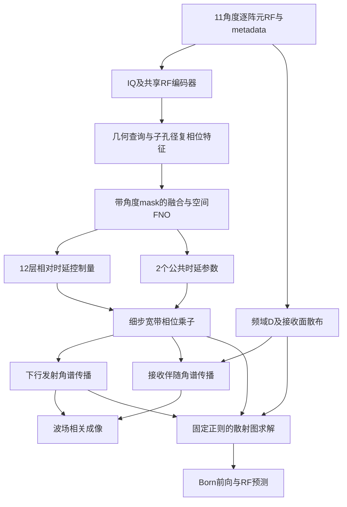

# 保留角谱法的11角度相位畸变校正：后续规划

日期：2026-09-16  
项目：`/home/zhuangyang/fmmodel/neural_asp`  
状态：设计草案。已重新核对角谱传播、Born前向/伴随及相关测试；本次没有修改模型或启动实验。

配套文档：[直接相对时延校正方案](2026-09-16-11angle-relative-phase-design.md)。本文规划另一条主成像路径：**RF → 有效相位传播参数 → 角谱传播与波场相关成像**。

## 1. 推荐结论

可以继续做角谱法，而且能保留当前项目最有价值的部分：发射与接收波场传播、衍射建模、Born前向预测和可验证的伴随。

推荐把目标改为：**用11角度RF估计少量随深度变化的有效相位屏，在角谱传播的每个细步中施加相位调制，以成像质量和独立观测一致性评价结果。** 网络不输出声速图，也不以声速RMSE选模型。

具体分两级推进：

- **V1：低维有效时延屏。** 保留均匀参考角谱传播，网络输出横向相对时延控制量，另用极少量参数描述公共传播时间偏差。这一版最容易与现有代码衔接。
- **V2：方向相关的相位传播修正。** 只有V1的理想参数也无法解释畸变、且误差确实与传播方向有关时，再增加受约束的横向波数相位项。

下一步最值得做的工作是**先不训练网络，直接优化有效相位屏，验证它在当前数据上是否有收益**。这能区分“传播表示不够”和“网络没有学会”，避免继续扩大一个收益尚未确认的声速/相位分支。

## 2. 现有角谱实现可以保留什么

在 `physics/angular_spectrum.py` 中，一个细步是：

\[
A_j u=P_{\Delta z/2}\left[
\exp(i\omega\,\delta s_j(x)\Delta z)
P_{\Delta z/2}u\right],
\]

\[
P_hu=\mathcal F_x^{-1}
\left[\exp(i k_z h)\mathcal F_xu\right],\qquad
k_z=\sqrt{(\omega/c_0)^2-k_x^2+i\epsilon}.
\]

| 位置 | 当前作用 | 规划 |
|---|---|---|
| `half_transfer()`，59行 | 均匀介质角谱传递函数 | 保留；补充采样/边界检查 |
| `screen()`，66行 | 从慢度生成相位乘子 | 改为从有效时延控制量生成 |
| `_step()`，87行 | 半步传播—相位—半步传播 | 保留对称结构 |
| `_step_adj()`，93行 | 同一细步的Hermitian伴随 | 随新乘子同步更新 |
| `forward()`，100行 | 下行发射波场 | 保留，所有角度共享相位传播参数 |
| `march_up()`，120行 | 散射源返回接收面 | 保留物理反向传播，不改成伴随 |
| `adjoint()`，137行 | 测量到各深度的伴随回传 | 保留并测试 |
| `physics/imaging.py:142–188` | 发射场、Born前向、伴随和照明 | 保留主体公式，改参数接口 |
| `models/pipeline.py:95–105` | 学习型m展开 | 暂不作为首轮相位收益判据，先用固定重建器 |

当前有216个成像深度节点，实际使用215个相邻传播细步；最后一行 `delta_s` 不再生成后续传播步。新接口应明确区分“节点”与“细步”，输出215步所需参数，避免深度错一层。

接收数据先通过 `S^H` 从阵元散布到计算平面，再进行复波场传播。这种线性叠加与直接把所有阵元压成一张包络图不同；无需为了保留阵元相位证据而把每个阵元的全深度波场都单独保存。

## 3. 先说明：预测相位屏与预测慢度是什么关系

如果只是定义：

\[
\phi_j(x,f)=2\pi f\Delta z\,\delta s_j(x),
\]

然后把输出名称从 `delta_s` 改成 `phi`，两种模型等价。改名称不会消除反问题的非唯一性，也不会自动提高成像质量。

V1的实际变化应是：

1. 从全图声速监督转向有效传播时延、波场相位和成像任务监督。
2. 用少量深度控制层与横向控制点限制传播自由度。
3. 单独处理公共到达时间与横向相对畸变。
4. 先证明传播参数有用，再训练RF到参数的网络。

**V1仍然可以写成某个等效慢度场。** 它是一种受约束的有效传播参数化，不能据此宣称与慢度完全无关或代表唯一的真实介质。用户“不再预测声速图”的要求可以通过任务目标、输出接口和监督方式实现，不必为了形式上的区别立刻引入巨大自由度。

若希望传播表达能力也超出现有局部慢度相位屏，V2才是明确的模型扩展。

## 4. 三条角谱路线比较

| 路线 | 预测量与传播方式 | 主要优点 | 主要风险 | 建议 |
|---|---|---|---|---|
| A：均匀角谱传播后乘累计相位图 | `psi(z,x,f)`，只修饰已经传播的场 | 实现简单 | 一般不能修复此前错误传播造成的横向衍射；也容易破坏收发和前向/伴随一致性 | 仅作弱基线 |
| **B：多层有效时延屏嵌入分步角谱** | `tau_l(x)` → 每个细步的复相位乘子 | 复用现有物理；相位在后续传播中影响波场形状；可共享到留出发射角 | 与等效慢度仍有关；屏与m可能串扰 | **V1主方案** |
| C：空间相位 + 波数方向相位 | `tau_l(x)` 与少量 `b_l(kx)` 系数 | 可以修正一部分传播方向相关误差 | 参数辨识更难，必须约束互易性与伴随 | 有明确误差证据后做V2 |

不要给11个发射角各预测一套互不相关的传播屏。静态介质的传播算子应跨发射共享；每个平面波因初始条件不同，自然经历不同传播。按发射角任意分开学习，会弱化这个约束，也不利于真正预测未输入角度的RF。

## 5. V1：有效相位屏的数学定义

### 5.1 输出控制层，而不是声速图

默认设置：12个深度控制层，每层48个横向控制点。网络输出：

```text
tau_rel_ctrl [B,12,48]   # 单位s，层内横向相对时延
bulk_coeff   [B,2]       # 单位s，公共累计传播时延的低维系数
```

共有576个相对控制值和2个公共参数。控制层位置预先固定在成像深度范围内，首版不学习层位置，也不把12个控制层等同于只传播12步。

各层横向曲线经固定B样条插值后，在固定的物理视野权重下去均值：

\[
\sum_x w_x\tau^{rel}_l(x)=0,\qquad\sum_x w_x=1.
\]

`w_x`使用固定几何有效区域，不由网络预测，不依赖测试标签。边界扩展方式也必须固定：中心物理视野内插值，向计算域保护带平滑延伸。

### 5.2 将控制量分配到215个细步

定义固定的非负深度权重 `W[j,l]`，每个控制层的权重沿深度归一化为1：

\[
W_{jl}\ge0,\qquad\sum_{j=0}^{214}W_{jl}=1.
\]

可用局部支撑的三角/B样条深度基；它只决定每个控制量如何分布到相邻细步。则：

\[
\tau^{rel}_j(x)=\sum_{l=1}^{12}W_{jl}\tau^{rel}_l(x).
\]

`tau_l`是对应深度基上的积分时延系数；`tau_j`已经是单个细步的时延。生成相位时使用 `omega*tau_j`，**不能再乘一次dz**。

完整传播仍保存/访问原来的成像深度节点，在各节点注入散射源并成像。这样既保留细网格成像，也不让神经网络独立预测每一层的每个像素。

### 5.3 公共时延不能随意删掉

横向均值相位在单频单层上看起来只是一个公共相位；沿深度累积后，它会改变不同散射深度的相位。在宽带中还对应包络到达时间，不能在声称RF数据一致性的同时把它完全删除。

建议用两个固定深度函数描述单程公共累计时延：

\[
G(z)=\beta_1(z/L)+\beta_2(z/L)^2,\qquad G(0)=0,
\]

其中z从实际接收面计量，L为最深成像点深度。细步公共量为：

\[
g_j=G(z_{j+1})-G(z_j),\qquad
\tau_j(x)=\tau^{rel}_j(x)+g_j.
\]

接收面到首个像素的非零传播距离也要包含 `G(z0)-G(0)`，不能只处理后续215步。公共量在整张计算平面上使用相同值。

这两个参数表示低维到达时间偏差，不输出声速图。它们也并非保证可从数据唯一估计；应采用教师/已知点靶约束、弱范围限制，并与 `bulk_coeff=0` 做消融。

已知 `t_ref` 属于采集元数据，在发射初始场中显式应用；禁止让 `bulk_coeff` 拟合遗漏的发射时序。若坚持网络只能输出纯相对量，应固定公共项，并把成像定位与RF残差的损失作为该限制的一部分报告。

### 5.4 相位、频率与范围

\[
C_j(x,f)=\exp[i2\pi f\tau_j(x)],\qquad
A_j=P_{\Delta z/2}C_jP_{\Delta z/2}.
\]

使用实际频率生成相位，沿用项目 `D=conj(FFT(rf))` 和 `exp(-i omega t)` 约定。参数是连续时延，不回归单频包裹相位，不逐频独立预测210张相位屏。

在单位换算中以微秒为网络数值尺度。初始相对控制层范围可用 `±0.2 μs`，公共累计时延 `G(z)` 限制在 `±2 μs`；二者是pilot起点。正式范围从训练教师的积分时延分布确定，并记录饱和比例。不同L和W归一化会改变层系数尺度，不能改变层数却继续使用未经调整的同一范围。

先去均值，再对整条层曲线整体缩放到范围内，避免逐点clip破坏相对参考。公共范围直接约束整条 `G(z)`，而不仅分别限制两个beta。所有预测头零初始化，初始传播退化到正确的均匀参考算子。

### 5.5 保持反向传播、伴随与互易性

接收前向仍按反向深度次序应用物理传播步；在目前的对称split-step结构中，可以沿用 `march_up` 的组织方式。相位共轭出现在伴随算子中：

\[
A_j^H=P_{\Delta z/2}^{H}C_j^H P_{\Delta z/2}^{H}.
\]

Hermitian伴随不等于物理逆传播。特别是倏逝波和边界衰减存在时，不能取传递函数的倒数来回传，否则会放大衰减分量。

采样/散布、保护带、固定滤波、裁剪及频谱响应都要成对纳入前向和伴随。网络通过RF估计参数，使整个管线对RF是非线性的；伴随恒等式测试针对**固定一组传播参数时的线性m→D算子**，不要把二者混淆。

## 6. 网络设计：优先复用当前框架

### 6.1 总体结构



主图像来自角谱波场相关，DAS/几何查询只用于特征提取和基线，不替代角谱成像。

### 6.2 编码与聚合

沿用 `RFEncoder` 的跨角共享卷积思想，增加按样本实数RMS的特征归一化和实际角度/坐标编码。原RF/D保留物理幅值，归一化只作用于网络特征。

旧 `delay_integrate` 把整个孔径直接合成一个特征。建议新增**8个重叠子孔径**的查询摘要，保留每个子孔径的复数IQ和编码特征；另外输入局部接收间隔1/2/4的复相关特征，以减少大孔径求和对相位证据的损失。子孔径数8/16作为最初容量消融，不一开始物化全视野的192阵元特征图。

子孔径通道和逐角度特征统一投影到32维；使用实际角度位置编码和带mask的注意力/均值聚合，再进入空间FNO。FNO起始宽度32、4层、模式数 `[12,10]`，可优先复用已有组件；是否增加宽度由pilot决定。

为支持8→3严格留出实验，移除 `2*n_call_angles` 固定DAS通道拼接。输出为共享的介质传播参数，不需要为未输入角度额外预测一张相位图。

### 6.3 输出头

空间latent为 `[B,32,54,48]`。用固定深度投影将54行映射到12个控制层，再用共享卷积输出 `[B,12,48]`。这个投影与细步展开W的定义分别保存，标签构造时也使用同一参数化。

另以深度摘要接MLP输出2个bulk系数。相对头和bulk头分别归一化和约束；相对头不携带DC均值。

V1只训练一个传播参数网络。`ComplexProx` 在最初阶段冻结或由固定求解器替代，不同时加入新的图像生成器、逐阵元幅值补偿器或每角度独立传播网络。

## 7. 角谱方案额外需要先做的数值检查

### 7.1 继承已发现的11角度metadata问题

前一份设计已核对：11角度配置未使用shard中的逐角度 `source_tref_s`；阵元中心坐标及真值像素中心也未统一。新基线应使用物理中心化阵列及正确真值网格：

```text
array.center_x = 0
grid.x0 = -19.125 mm
grid.z0 = 0.075 mm
dx = dz = 0.2 mm（输出网格）
t_ref = 从11角度metadata读取并逐例一致性校验
```

同样要核对完整210频点与旧53频点D、源脉冲响应、接收滤波和幅值缩放。三角度k-Wave响应校准文件不能直接搬到11角度UltraWave数据。

### 7.2 输出网格与传播网格应允许不同

当前传播横向步长0.2 mm。在7.5 MHz、1540 m/s时，能在该离散网格上表示的传播方向受到：

\[
|\sin\alpha|\le\frac{c_0}{2f\Delta x}\approx0.5133
\]

限制，即约±30.9°。±8°发射在其中，但接收传播还可能包含更大的横向波数，特别是浅层、大孔径和强横向散射。不能仅根据发射角小，就认定横向采样足够。

建议以 `dx_prop=0.2/0.1 mm` 做数值收敛对照，同时增加FFT保护带。若0.2 mm足够则采用较低成本配置；若需要0.1 mm，输出图仍可保持216×192。

细化计算网格不会创造192阵元、0.2 mm间距采集中原本没有测到的空间信息，也不会自动消除物理阵列的混叠。其目的是减少计算传播中的额外离散误差。

一个候选细网格是横向768点、0.1 mm间隔、物理宽度76.8 mm，中心区域覆盖原38.4 mm视野；最终取值由保护带收敛决定。所有x原点、阵元插值和输出裁剪都必须明确保存。

若m在输出网格而波场在更细网格，显式定义实值插值/嵌入算子J：前向使用 `Jm`，伴随用精确转置 `J^H` 返回输出网格，并包括离散积分权重。不能前向普通resize、伴随另做一次平均后仍声称是同一个算子的伴随。

### 7.3 FFT边界与深度细步

在整个传播过程中保留保护带，在边缘施加固定衰减窗；不要每步裁到192点后再补零。若采用边缘窗Q，可用 `Q P C P Q` 的对称放置，并在伴随中保持严格对应。

深度步长按屏变化尺度和split-step误差检查0.2/0.1 mm。均匀角谱传播的相位是解析计算的，不应机械套用时域有限差分“每波长多少网格点”的同一规则；但相位屏、散射积分和空间变化仍需收敛验证。

测试除均匀平面波外，还要包含倾斜波、非均匀屏、边缘点目标及同物理视野不同padding。只通过伴随测试不能证明物理离散足够准确。

## 8. 先做什么实验：不训练网络的相位屏pilot

### 8.1 数据与比较对象

选取训练集12例、验证集6例，覆盖现有两个训练来源病例与不同切片/畸变强度。正式50例测试集不参与pilot选择。另建立独立的已知点靶/散斑实验，包含均匀、表层薄屏、横向变化和分布式畸变。

至少比较：

| 编号 | 参数/方法 | 目的 |
|---|---|---|
| U0 | 正确metadata的均匀角谱算子 | 新的可信零校正基线 |
| C* | 已知声速输入原异质角谱 | 判断原传播模型在该场景的可用收益 |
| P* | 把已知介质的传播作用拟合到12层有效屏 | 判断低维表示是否足够 |
| P-fit | 固定m或固定重建准则，直接优化屏参数 | 判断数据能否支持优化 |
| P-rel | 公共项固定零，只允许相对屏 | 测量丢掉公共时延的影响 |

`C*`在同一Born生成器内可以视为已知介质参考；在UltraWave数据上只是“已知声速下的近似角谱模型”，不保证是成像性能上界。文档和图例中应区分。

### 8.2 两种m条件必须分别做

**第一种：散射体已知。** 在独立构造的点靶/可控散射仿真中固定正确m，优化相位屏，检查留出角度和位置。它用于验证参数与符号，不能用现有乳腺代理m冒充准确复散射真值。

**第二种：散射体未知。** 在现有UltraWave RF上使用固定正则求解：

\[
m_\eta=\arg\min_m\|F_\eta m-D_{in}\|_2^2+\lambda\|m\|_2^2.
\]

先采用CG求解正规方程，lambda用均匀算子和训练数据固定尺度设定；记录10/25/50步的敏感性，并检查相位收益是否随m求解深度消失。不同方法使用同一停止准则和最大步数。

外层交替更新m与屏，更新屏时固定本轮m；首个pilot采用6轮外迭代，每轮屏参数最多20个优化步，并监控输入残差、留出残差及成像变化。这是交替优化，不宣称等价于对精确内层最优解求完整双层梯度。

当前自由复数m会吸收传播误差。固定正则并不能保证消除这一问题；若仅输入残差改善而留出/点靶成像没有改善，应判断为过拟合或串扰，不能据此开始大规模训练。

### 8.3 pilot通过后才训练网络

需要看到三类证据：

- 已知参数能改善聚焦，且12层有效表示保留了大部分可实现收益。
- 直接拟合相位参数的结果可以泛化到未参与拟合的角度或独立位置。
- 改善不是靠公共时间修补错误metadata、逐样本拟合频响或改变图像显示获得。

若C*有效而P*无效，增加控制层/横向分辨率或调整表示；若P*有效而P-fit无效，优先解决参数辨识与m串扰；若C*也无效，先调查算子与全波数据的失配。

## 9. 标签与监督设计

### 9.1 可用的三级标签

1. **合成有效屏真值。** 直接在角谱算子里采样相位控制量，再生成RF，用于验证网络能否恢复已知有效参数。这存在同模型训练/测试优势，不能作为全波泛化证据。
2. **已知介质的初始化标签。** 将 `delta_s*dz` 拟合到固定深度/横向基，分离bulk与相对项。这是等效慢度先验；仅用这种标签训练，仍基本属于慢度的任务化重参数化。
3. **传播响应蒸馏标签。** 在已知介质的多个入射条件下，拟合能重现相对波场、跨频到达时间或独立点靶RF的有效屏。教师可以是原异质角谱或小规模独立全波；二者分别报告。

优先做1和2启动pilot，用3检验参数是否真能更直接地服务成像。由已知声速生成离线教师不等于推理时预测声速；如果训练也不允许接触声速，只使用1及受约束的RF/成像优化，结论应更保守。

现有数据没有保存中间发射/接收波场，因此全波响应蒸馏需要新增离线记录功能。不要把当前 `reference_native.npz` 当成每个乳腺样本的理想无畸变波场，也不要直接对混合散射RF取相位比构造逐层标签。

### 9.2 参数、波场和数据损失

可用的组合：

\[
L=\lambda_\tau L_{\tau,rel}+\lambda_bL_{bulk}
+\lambda_wL_{wave}+\lambda_dL_{data}
+\lambda_iL_{image}+\lambda_rR.
\]

参数损失为同参考规范下的无量纲Huber；相位损失使用 `1-cos(delta_phi)`，并辅以连续时延损失避免整周期歧义。参数标签非唯一时，不能要求网络恢复某一任意屏分配；应以传播响应损失为主要依据。

相对波场损失可以比较可靠位置/空间点之间的相位差或归一化复相关，同时用时域到达时间、bulk标签或固定系统响应下的RF损失约束公共频率相位。不能在每个深度、每个频率都任意拟合复标量后，还声称公共时延已得到验证。

RF损失使用同频率网格、同频谱响应的复数残差，并按样本观测能量归一化。固定带宽权重可用于稳健训练，但评估必须报告明确的频带；不能让网络自由降低难拟合频点的权重。

图像损失仅在有可信参考时使用。现有高通阻抗代理m可以提供有限的结构诊断，不能作为准确的复图像逐点监督。相干性是辅助证据，单独最大化它可能聚焦到错误散射点。

正则采用横向二阶平滑、相邻控制层平滑、bulk范围及小参数幅度；按物理距离和时延尺度归一化。不要同时堆叠多个表达同一约束的损失。

### 9.3 训练顺序

| 阶段 | 训练内容 | 其他部分状态 | 主要选模标准 |
|---|---|---|---|
| N1 | 有效屏网络预训练 | 固定物理，已知合成屏 | 相对时延/传播响应误差 |
| N2 | 介质/响应教师蒸馏 | 冻结m学习模块 | 独立验证波场与成像指标 |
| N3 | 少量RF一致性微调 | 固定正则m求解器 | 验证成像 + 输入/留出残差 |
| N4 | 可选恢复学习型m展开 | 相位头先冻结，再低学习率联合 | 是否增加真实成像收益 |

N1/N2学习率可从 `1e-4` 起步，N3/N4从 `2e-5` 起步，batch=1；优化器和早停规则在pilot后固定。初始候选也参加验证选优。每阶段必须保存“相位场/公共项/图像/RF残差”一起比较，避免只看一个训练loss。

本规划不要求立即运行完整500例长训练，先完成第8节pilot和物理检查。

## 10. 11角度主实验与严格留出

**主实验：全部11角度输入。** 网络估计一组共享传播参数，用相同11角度重建和比较。训练/验证/测试按已有样本划分，明确3病例、500切片的统计限制。

**辅助实验：8角度估计，3角度预测。** 网络的编码、归一化、m求解、屏优化均只使用8个输入角。传播参数确定后，用未输入角度的已知发射初始条件产生 `u_tx_hold`，再计算 `F_eta_hold(m)`。整个预测阶段不读取目标RF。

这条角谱路线能够保留原项目真正的留出RF预测机制，是相对于直接像素时延成像路径的重要区别。固定留出索引可沿用 `[2,5,8]`，但不要以0°作为必须存在的相位参考。

主11角度模型和8→3模型分别训练/报告。对留出RF再拟合的逐频复增益只能作为诊断；正式指标使用训练集固定的系统响应。

必做消融：均匀角谱、原声速分支、已知声速角谱、纯相对屏、相对屏+bulk、控制层数4/8/12/24、固定/学习型m求解器。后续再比较V2及与前一份直接时延DAS方案的成像质量、速度和成本。

## 11. 什么时候才进入V2

V1若在已知介质/波场oracle中仍出现稳定的方向相关残差，可增加一个**与发射索引无关、作用于波场横向波数的相位项**。

候选细步结构：

\[
A_j=P_h C_j^{1/2}K_j C_j^{1/2}P_h,
\]

\[
K_j=\mathcal F^{-1}\operatorname{diag}
\{\exp[i\psi_j(k_x,f)]\}\mathcal F,
\]

\[
\psi_j(k_x,f)=2\pi f\,[b_{j,2}\kappa^2+b_{j,4}\kappa^4],
\qquad\kappa=k_x/(2\pi f/c_0).
\]

只在定义明确的传播波数带内应用，带外使用固定处理。b也用少量深度控制系数展开；12层、每层2项只新增24个系数。初始b=0，优先单独拟合二次项，必要时再开放四次项。

偶函数波数相位使K在理想一致网格上满足转置对称；结合上述回文式乘法结构，有利于保持单步互易性。真正的离散实现仍要逐项验证，包括padding、滤波和采样；不能只凭偶函数形式宣称完整物理互易性已成立。

该项是非局部横向传播修正，不是给11个发射角各拟合一张图。与局部乘性屏相比，它增加了传播方向相关的表达能力，但仍不是任意复杂介质的精确传播算子。首版不开放任意复幅值、逐频自由相位或大型 `x×kx×z×f` 张量。

若剩余问题主要来自多次散射、反射、衰减或出平面效应，这种相位修正也未必能解决，应先修改相应物理假设。

## 12. 显存与数值测试

原216×192传播网格上，一个11角度、210频点的complex64全深度场约731 MiB；发射场、接收场、散射源和反向图会叠加。横向网格细化和保护带会进一步放大成本。

采用频率分块（起点8频点）、角度分块及深度检查点。以横向768点计，11角度×8频点×216深度的一个complex64场约111 MiB，仍不是总峰值。需要对完整前后向实测显存。

频率分块的前向损失可以按块累积，但m求解的正规算子必须包含完整选定频带，各块贡献相加；不能为每个频率块独立拟合一张m再当作同一问题。

新增/扩展验证应包括：

1. 零屏+零bulk退化到同网格同边界下的均匀基线。
2. `tau_j=delta_s_j*dz` 时与旧细步数值一致。
3. 常数/非均匀屏、正负时延、跨周期频率相位和深度索引检查。
4. 固定参数下单步及Born全算子的伴随恒等式；小尺寸complex128目标相对误差 `1e-8` 以内。
5. 屏与bulk参数梯度对有限差分；误差门槛按数值差分步长收敛确定。
6. J/J^H、S/S^H、频率分块与不分块的一致性。
7. padding、dx、dz收敛，以及浅层/边缘点目标定位。
8. 严格留出检查：扰动留出RF时，已估参数、m及预测留出RF不变。

梯度测试使用与目标场或RF相关的损失；不要仅用理想无损传播的总能量，因为相位改变可能保持总能量，导致测试对相位参数不敏感。

## 13. 建议文件与交付顺序

| 后续文件 | 职责 |
|---|---|
| `models/phase_screen_operator.py` | RF编码、子孔径特征、共享传播参数预测 |
| `physics/phase_screens.py` | 深度/横向基、规范分解、bulk与频率相位生成 |
| `physics/angular_spectrum.py` | 接收显式细步相位乘子，保持三种传播原语 |
| `physics/imaging.py` | 支持新参数与传播/成像网格映射 |
| `models/phase_asp_pipeline.py` | 新角谱相位成像与RF预测管线 |
| `scripts/pilot_phase_asp.py` | 无网络oracle、直接参数优化及诊断 |
| `train_phase_asp.py / eval_phase_asp.py` | 新监督、训练与11角度/8→3协议 |
| `configs/l11_phase_asp.yaml` | metadata、控制基、计算网格与训练设置 |

最先形成三个可审查交付物：

1. `metadata_and_asp_baseline.md`：时间/坐标/频带/计算网格核对，正确均匀基线。
2. `phase_screen_oracle_report.md`：U0/C*/P*/P-fit/P-rel的图像、RF残差、失败例和数值收敛结果。
3. `phase_asp_network_spec.md`：根据oracle结果确定控制层数、bulk需求和是否需要V2，再锁定训练网络。

以上代码和报告是下一阶段规划，本次没有创建或运行。现有声速管线作为对照保留，新checkpoint使用独立版本，记录所有几何、基函数、参考规范、频率与系统响应信息。

## 14. 推荐的推进判断

| 观察结果 | 下一步 |
|---|---|
| 正确metadata就明显改变图像/RF残差 | 重新建立全部基线后再讨论神经分支收益 |
| 已知声速角谱有效，12层屏无效 | 优先调整屏的控制容量与深度分配 |
| 屏oracle有效，直接屏优化无效 | 解决参数辨识、标签和m串扰 |
| 直接屏优化有效，网络无效 | 改善输入相位证据与数据泛化 |
| 只有bulk有效，相对屏无附加收益 | 如实报告到达时间修正，不宣称分布式畸变校正成功 |
| 参数/输入残差改善，留出或图像变差 | 判定过拟合，收紧自由度或改变监督 |
| 局部屏oracle存在稳定方向误差 | 尝试受约束的V2波数相位项 |
| 角谱已知介质也不能解释全波数据 | 调查幅值响应、采样、单向/Born近似和多径 |

## 15. 参考依据

Fourier split-step用于分布式畸变校正已有研究，其中也区分了平均传播与横向残差，并讨论深度定位歧义。这支持继续沿角谱波场相关成像推进，但不证明本文提出的12层参数网络能够成功。[Ali等：Sound Speed Estimation for Distributed Aberration Correction in Laterally Varying Media](https://pmc.ncbi.nlm.nih.gov/articles/PMC10665028/)

异质角谱方法也被用于经颅聚焦和点散射成像；本文只借鉴“通过传播模型产生相位校正”的路线，不把经颅结果直接外推到乳腺11角度数据。[Heterogeneous Angular Spectrum Approach for Trans-skull Imaging and Focusing](https://arxiv.org/abs/1906.08156)

计算域截断、零填充和传播角限制是角谱数值实现中需单独处理的问题。本文的网格建议是结合当前采集参数计算的候选配置，最终应以收敛试验确定。[Michigan State University FOCUS：Angular Spectrum Approach](https://www.egr.msu.edu/~fultras-web/background/asa.php)

**建议下一次实际执行的范围：完成metadata/均匀角谱基线，然后做无网络的12层有效相位屏pilot。只有这一步显示独立成像收益，再进入网络训练。**
